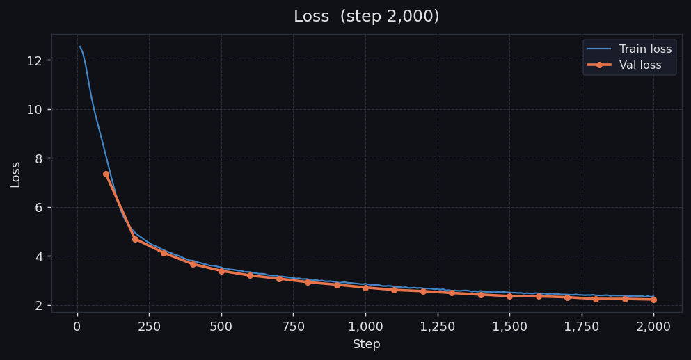
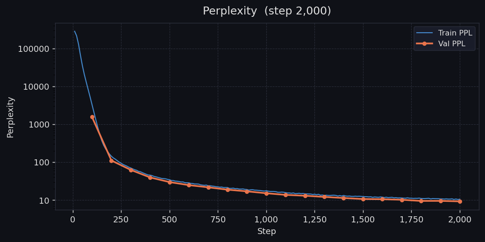
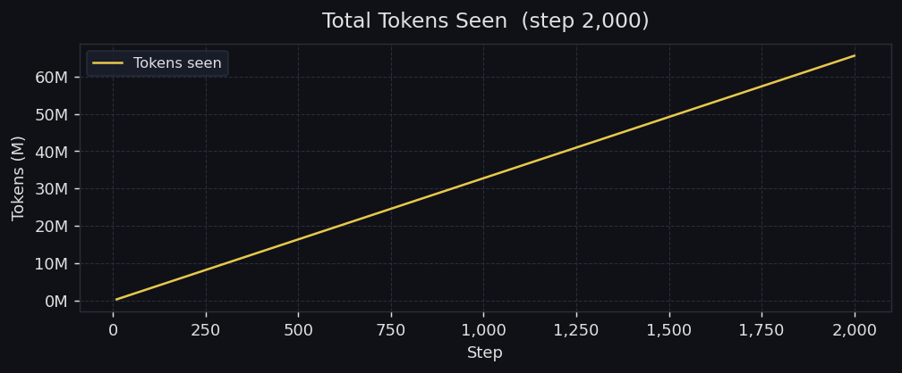

<p align="center">
  
</p>

<h1 align="center">gptoss</h1>

<p align="center">
  <b>A production-grade, from-scratch Decoder-Only Transformer (LLM) in PyTorch</b><br/>
  <sub>Mixture-of-Experts · Grouped Query Attention · Rotary Position Embeddings · Native KV Caching</sub>
</p>

<p align="center">
  
  
  
  
  
</p>

---

## Overview

**gptoss** is an open-source, research-oriented implementation of a modern Large Language Model built entirely from scratch in PyTorch. It incorporates the same architectural innovations found in state-of-the-art LLMs — including **Sparse Mixture-of-Experts**, **Grouped Query Attention**, and **Rotary Positional Embeddings** — while remaining readable, hackable, and well-documented enough to learn from.

The model was trained on an **NVIDIA H200 GPU** (141 GB HBM3e memory, 4.8 TB/s memory bandwidth), purpose-built for accelerating large-scale generative AI workloads. The H200's massive memory capacity and bandwidth make it possible to train a 3.66 B-parameter MoE model entirely in-GPU, eliminating the bottlenecks that would otherwise require multi-GPU parallelism.

---

## ✨ Key Features

| Feature | Description |
|---|---|
| **Sparse Mixture-of-Experts (MoE)** | 32 experts per layer with top-2 gated routing and auxiliary load-balancing loss for even expert utilisation |
| **Grouped Query Attention (GQA)** | 32 query heads mapped to 8 KV heads — 4× reduction in KV cache memory with negligible quality loss |
| **Rotary Position Embeddings (RoPE)** | Context-aware relative positional encoding via rotate-half; generalises to unseen sequence lengths |
| **Native KV Caching** | Custom Prefill + Decode pipeline — prompt is processed in a single forward pass, then tokens are generated one-at-a-time with O(1) per-step attention cost |
| **OpenAI Tiktoken (`o200k_base`)** | 200 K-token vocabulary used natively by GPT-4o / o-series models |
| **Mixed-Precision Training** | Full AMP support (`bfloat16` / `float16`) with gradient scaling, maximising H200 Tensor Core throughput |
| **`torch.compile` Ready** | One-flag graph compilation for significant training speedups |
| **RMSNorm Pre-Norm** | Stable training with Root Mean Square Layer Normalisation applied before attention and FFN |
| **Live Metrics & Plotting** | Dark-themed Matplotlib dashboards for Loss, Perplexity, LR schedule, Throughput, and Tokens Seen — generated automatically at every checkpoint |

---

## 🏗️ Architecture

<p align="center">
  
</p>

The architecture follows a **Pre-Norm Decoder-Only Transformer** design:


### Default Configuration

| Hyperparameter | Value |
|---|---|
| Embedding Dimension (`d_model`) | 1024 |
| Context Length | 2048 tokens |
| Transformer Blocks | 12 |
| Query Heads | 32 |
| KV Heads (GQA) | 8 |
| MoE Experts | 32 |
| Active Experts (Top-K) | 2 |
| FFN Hidden Dim (`d_ff`) | 2048 |
| Vocabulary Size | 200,019 (`o200k_base`) |
| **Total Parameters** | **3.66 B** |

> With 32 experts and top-2 routing, only ~6.25 % of expert parameters are activated per token, giving the model the capacity of a 3.66 B-param network while maintaining the compute cost of a much smaller dense model.

---

## 📊 Training Results (NVIDIA H200)

The model was trained on the [TinyStories](https://huggingface.co/datasets/roneneldan/TinyStories) dataset using an **NVIDIA H200 141 GB** GPU. Below are the live metrics captured during a 2,000-step training run.

### Loss Curve

<p align="center">
  
</p>

Training loss dropped from **12.5 → 2.3** and validation loss from **7.4 → 2.3** over 2,000 optimiser steps. The tight convergence between train and val curves indicates healthy generalisation with no overfitting.

### Perplexity

<p align="center">
  
</p>

Perplexity collapsed by **four orders of magnitude** — from >250,000 to **~10** — demonstrating rapid language modelling capability acquisition. The log-scale chart shows the steepest improvement occurs in the first 250 steps, with steady refinement thereafter.

### Tokens Seen

<p align="center">
  
</p>

The model consumed approximately **65 M tokens** across 2,000 steps with a linear throughput profile, confirming stable data pipeline performance on the H200's 4.8 TB/s HBM3e memory bus.

---

## 💬 Sample Generations

After just 2,000 training steps (val loss = **2.2493**), the model produces coherent, contextually appropriate narratives:

<p align="center">
  
</p>

```
Prompt: "ben was playing with the ball"

ben was playing with the ball 3-year-old, and he was having so much fun that he
forgot to stop playing. The little boy's parents told him that it was important
for him to be careful. So, the little boy played with his ball and took it with
him on the rough road. The little boy was so happy and he ran around with his
family, playing with a ball and laughing. They were so happy, and the little boy
was happy to have such a great day.
```

<p align="center">
  
</p>

```
Prompt: "ben was a brave boy"

ben was a brave boy 3 year old girl named Jane. Jane was always looking for ways
to play with her friends. One day, Jane and her friends decided to play a game.
They decided to play a game. Jane was very good at the game and she was very good
at it. She would kick the ball and have lots of fun. But then something happened.
Jane's friends came to help her. They looked at her and said, "You are too good
at kicking the ball. You should be careful and be careful. Fighting is not fun."
Jane was very sad. She had lost her game and now she had to give up. She looked
at the ball and smiled. She was happy she could play with her friends again.
```

> **Note:** These outputs are from a model trained for only **2,000 steps on ~65 M tokens**. With extended training, output quality improves substantially.

---

## 🚀 Getting Started

### Prerequisites

- Python 3.8+
- PyTorch 2.x+ (CUDA recommended)
- NVIDIA GPU with ≥24 GB VRAM (H200 / A100 / H100 recommended for full-scale training)

### Installation

```bash
git clone https://github.com/yourusername/gptoss.git
cd gptoss
pip install torch tiktoken matplotlib numpy datasets tqdm
```

### 1. Prepare Data

Tokenise and shard the TinyStories dataset into memory-mapped `.npy` files:

```bash
python prepare_data.py
```

This downloads the dataset from HuggingFace, tokenises with `o200k_base`, and writes shards to `data/train/` and `data/val/`.

### 2. Train

```bash
# Standard training
python train.py

# Recommended: full run with compilation and mixed precision
python train.py --batch_size 8 --max_steps 20000 --compile --dtype bfloat16

# Override model architecture via CLI
python train.py --d_model 2048 --transformer_blocks 24 --num_experts 64
```

All hyperparameters (model and training) can be configured via `config_model.py` or overridden from the command line.

**Training outputs:**
- `checkpoints/` — Model weights (numbered + `latest.pt`)
- `artifacts/graphs/` — Auto-generated metric plots (Loss, Perplexity, LR, Throughput, Tokens Seen)
- `artifacts/graphs/metrics.json` — Raw metrics for custom analysis

### 3. Generate Text

```bash
# One-shot generation
python predict.py --prompt "Once upon a time" --temperature 0.8 --max_new_tokens 300 --top_k 50

# Interactive REPL mode
python predict.py

# Custom checkpoint
python predict.py --ckpt checkpoints/step_0010000.pt --prompt "The dragon"
```

**REPL commands:**
| Command | Action |
|---|---|
| `:t <float>` | Set sampling temperature |
| `:k <int>` | Set top-k |
| `:q` | Quit |

---

## 🔧 Training Configuration

| Parameter | Default | Description |
|---|---|---|
| `--batch_size` | 2 | Micro-batch size per GPU |
| `--grad_accum` | 8 | Gradient accumulation steps (effective batch = batch_size × grad_accum) |
| `--max_steps` | 50,000 | Total optimiser steps |
| `--lr` | 3e-4 | Peak learning rate |
| `--min_lr` | 3e-5 | Minimum LR (cosine annealing floor) |
| `--warmup_steps` | 1,000 | Linear warmup steps |
| `--grad_clip` | 1.0 | Max gradient norm |
| `--weight_decay` | 0.1 | AdamW weight decay |
| `--dtype` | `bfloat16` | Training precision (`float32` / `float16` / `bfloat16`) |
| `--compile` | `false` | Enable `torch.compile` graph compilation |

---

## 📁 Project Structure

```
gptoss/
├── config_model.py     # ModelConfig dataclass — all architectural hyperparameters
├── model_parts.py      # Core components: GQA+RoPE, MoE, KV Cache, Transformer block
├── model.py            # LLM class + autoregressive generate() function
├── train.py            # Full training loop with AMP, grad accumulation, metrics
├── predict.py          # Inference script (one-shot + interactive REPL)
├── prepare_data.py     # TinyStories download, tokenisation, and sharding
├── test.py             # Model summary / parameter count utility
├── public/             # Architecture diagrams, training graphs, screenshots
└── .gitignore
```

---

## 🖥️ Hardware

This model was developed and trained on:

| Component | Specification |
|---|---|
| **GPU** | NVIDIA H200 |
| **GPU Memory** | 141 GB HBM3e |
| **Memory Bandwidth** | 4.8 TB/s |
| **Precision** | BF16 / FP32 mixed |
| **Framework** | PyTorch 2.x + `torch.compile` |

The H200's 141 GB HBM3e capacity allows the entire 3.66 B-parameter model (weights + optimizer states + activations) to reside in a single GPU's memory, while the 4.8 TB/s bandwidth ensures the MoE routing and expert dispatch operations — which are inherently memory-bound — remain performant at scale.

---

## 🗺️ Roadmap

- [ ] Multi-GPU training with FSDP / DeepSpeed
- [ ] Sliding Window Attention for extended context
- [ ] Expert parallelism for efficient MoE scaling
- [ ] RLHF / DPO alignment fine-tuning
- [ ] GGUF / ONNX export for local inference
- [ ] Flash Attention 2 integration
- [ ] Larger dataset training (FineWeb, RedPajama)

---

## 📝 Citation

If you use gptoss in your research or projects, please consider citing:

```bibtex
@software{gptoss2026,
  title   = {gptoss: Open-Source Decoder-Only Transformer with MoE},
  year    = {2026},
  url     = {https://github.com/yourusername/gptoss}
}
```

---

## 📄 License

This project is open-source and available under the [MIT License](LICENSE).

---

<p align="center">
  <b>Built with ❤️ and PyTorch on NVIDIA H200</b>
</p>
