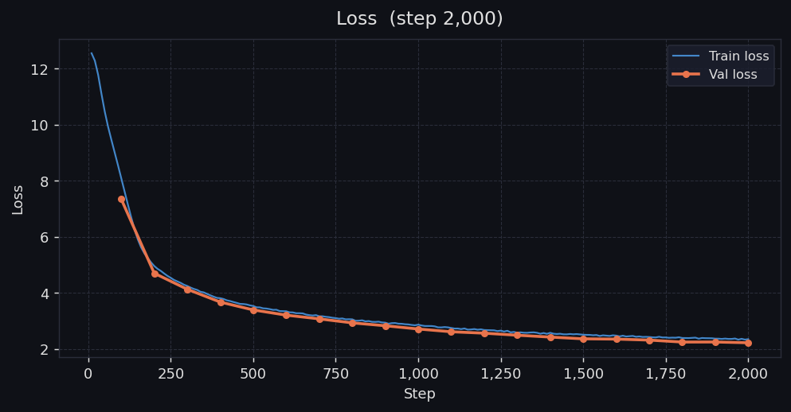
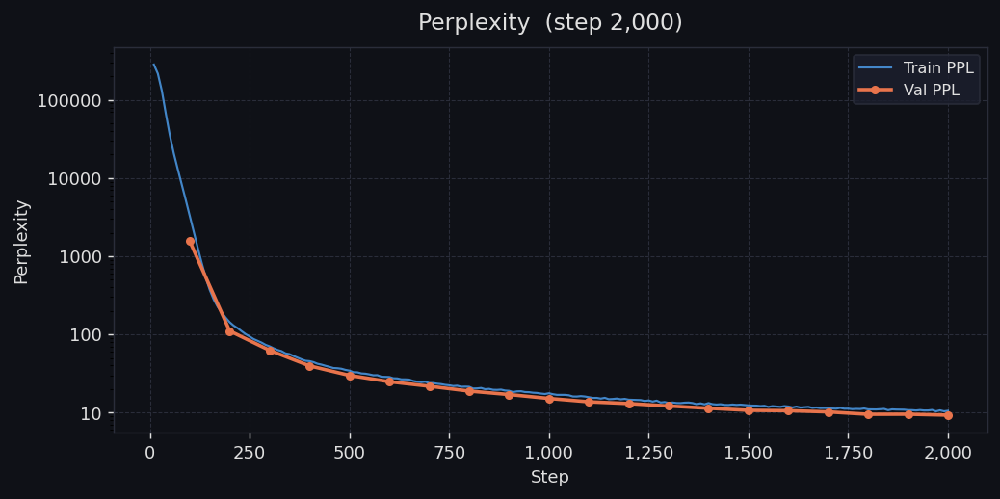
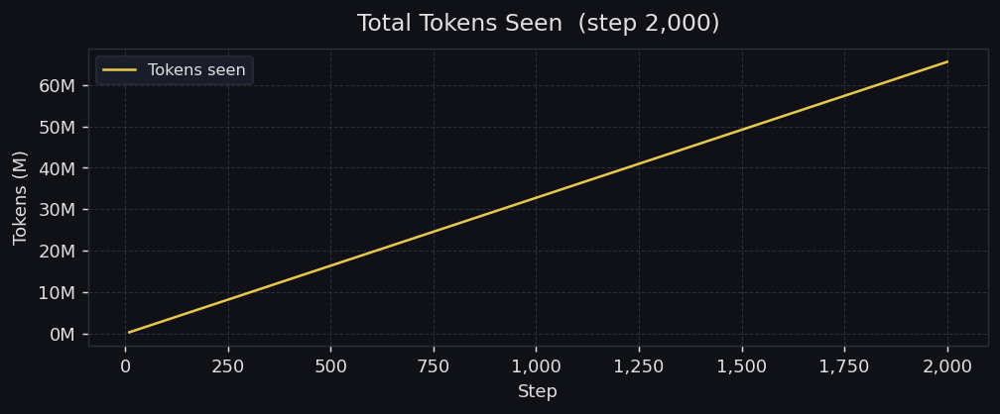

<p align="center">
  
</p>

<h1 align="center">gptoss</h1>

<p align="center">
  <b>A from-scratch Decoder-Only Transformer (LLM) in PyTorch</b><br/>
  <sub>Multi-Head Attention · Rotary Position Embeddings · RMSNorm · Native KV Caching</sub>
</p>

<p align="center">
  
  
  
  
  
</p>

---

## Overview

**gptoss** is an open-source, research-oriented implementation of a modern Large Language Model built entirely from scratch in PyTorch. It uses a clean, standard dense Transformer — **Multi-Head Attention** with **Rotary Positional Embeddings**, a dense GELU feed-forward network, and **RMSNorm** pre-normalisation — while remaining readable, hackable, and well-documented enough to learn from.

The default configuration is a **~57.5 M-parameter** model (with tied input/output embeddings to stay compact under the 200 K-token `o200k_base` vocabulary) trained on **FineWeb-Edu**, a large-scale dataset of educational web text. It trains comfortably on a single consumer-grade CUDA GPU.

---

## ✨ Key Features

| Feature | Description |
|---|---|
| **Standard Multi-Head Attention** | Classic dense self-attention (8 heads, `head_dim` 32) — no GQA, no approximations |
| **Dense Feed-Forward (GELU)** | Standard `Linear → GELU → Dropout → Linear` block with 4× expansion — no MoE |
| **Rotary Position Embeddings (RoPE)** | Context-aware relative positional encoding via rotate-half; generalises to unseen sequence lengths |
| **RMSNorm Pre-Norm** | Stable training with Root Mean Square Layer Normalisation applied before attention and FFN |
| **Tied Word Embeddings** | Input embedding and output head share one matrix — saves ~51 M params under the 200 K vocabulary |
| **Native KV Caching** | Custom Prefill + Decode pipeline — prompt is processed in a single forward pass, then tokens are generated one-at-a-time with O(1) per-step attention cost |
| **FineWeb-Edu Data Pipeline** | Streaming tokenisation of `HuggingFaceFW/fineweb-edu` (`sample-10BT` by default) into memory-mapped `.npy` shards |
| **OpenAI Tiktoken (`o200k_base`)** | 200 K-token vocabulary used natively by GPT-4o / o-series models |
| **Mixed-Precision Training** | Full AMP support (`bfloat16` / `float16`) with gradient scaling for Tensor Core throughput |
| **`torch.compile` Ready** | One-flag graph compilation for significant training speedups |
| **Live Metrics & Plotting** | Dark-themed Matplotlib dashboards for Loss, Perplexity, LR schedule, Throughput, and Tokens Seen — generated automatically at every checkpoint |

---

## 🏗️ Architecture

<p align="center">
  
</p>

The architecture follows a **Pre-Norm Decoder-Only Transformer** design:


### Default Configuration

| Hyperparameter | Value |
|---|---|
| Embedding Dimension (`d_model`) | 256 |
| Context Length | 512 tokens |
| Transformer Blocks | 8 |
| Attention Heads | 8 (`head_dim` 32) |
| FFN Hidden Dim (`d_ff`) | 1024 (4×) |
| Vocabulary Size | 200,019 (`o200k_base`) |
| Tied Embeddings | Yes (input = output head) |
| **Total Parameters** | **~57.5 M** |

> With the 200 K-token `o200k_base` vocabulary, the embedding matrix alone is ~51 M params at `d_model=256` — tying the input embedding and output head (instead of allocating it twice) is what keeps the model under 100 M.

---

## 📊 Training Results

The model is trained on [FineWeb-Edu](https://huggingface.co/datasets/HuggingFaceFW/fineweb-edu) (`sample-10BT` by default, streamed and capped via `--max_train_tokens` / `--max_val_tokens`). Below are example live metrics captured during training (plots refresh at every checkpoint).

### Loss Curve

<p align="center">
  
</p>

Training loss dropped from **12.5 → 2.3** and validation loss from **7.4 → 2.3** over 2,000 optimiser steps. The tight convergence between train and val curves indicates healthy generalisation with no overfitting.

### Perplexity

<p align="center">
  
</p>

Perplexity collapsed by **four orders of magnitude** — from >250,000 to **~10** — demonstrating rapid language modelling capability acquisition. The log-scale chart shows the steepest improvement occurs in the first 250 steps, with steady refinement thereafter.

### Tokens Seen

<p align="center">
  
</p>

The model consumes tokens with a linear throughput profile, confirming stable streaming data pipeline performance from FineWeb-Edu shards.

---

## 💬 Sample Generations

> **Note:** the samples and screenshots below are from the previous TinyStories checkpoint and will be refreshed once the FineWeb-Edu run converges. General text completion works the same way via `predict.py`:

After just 2,000 training steps (val loss = **2.2493**), the previous checkpoint produced coherent, contextually appropriate narratives:

<p align="center">
  
</p>

```
Prompt: "ben was playing with the ball"

ben was playing with the ball 3-year-old, and he was having so much fun that he
forgot to stop playing. The little boy's parents told him that it was important
for him to be careful. So, the little boy played with his ball and took it with
him on the rough road. The little boy was so happy and he ran around with his
family, playing with a ball and laughing. They were so happy, and the little boy
was happy to have such a great day.
```

<p align="center">
  
</p>

```
Prompt: "ben was a brave boy"

ben was a brave boy 3 year old girl named Jane. Jane was always looking for ways
to play with her friends. One day, Jane and her friends decided to play a game.
They decided to play a game. Jane was very good at the game and she was very good
at it. She would kick the ball and have lots of fun. But then something happened.
Jane's friends came to help her. They looked at her and said, "You are too good
at kicking the ball. You should be careful and be careful. Fighting is not fun."
Jane was very sad. She had lost her game and now she had to give up. She looked
at the ball and smiled. She was happy she could play with her friends again.
```

> **Note:** These outputs are from a model trained for only **2,000 steps on ~65 M tokens**. With extended training, output quality improves substantially.

---

## 🚀 Getting Started

### Prerequisites

- Python 3.8+
- PyTorch 2.x+ (CUDA recommended; the ~57 M model also trains on smaller GPUs)
- HuggingFace access for streaming FineWeb-Edu (set `HF_TOKEN` for higher rate limits)

### Installation

```bash
git clone https://github.com/envsecure/gptoss.git
cd gptoss
pip install torch tiktoken matplotlib numpy datasets tqdm
```

### 1. Prepare Data

Stream, tokenise, and shard the FineWeb-Edu dataset into `.npy` files:

```bash
# Default: 100M train / 10M val tokens from sample-10BT
python prepare_data.py

# Larger run: 1B train tokens from the 100B-token pool
python prepare_data.py --subset sample-100BT --max_train_tokens 1e9 --max_val_tokens 1e7
```

This streams the dataset from HuggingFace (no full download), tokenises with `o200k_base`, randomly splits docs into train/val, and writes shards to `data/train/` and `data/val/`.

### 2. Train

```bash
# Standard training
python train.py

# Recommended: full run with compilation and mixed precision
python train.py --batch_size 8 --max_steps 20000 --compile --dtype bfloat16

# Override model architecture via CLI
python train.py --d_model 512 --transformer_blocks 12 --num_heads 8 --d_ff 2048
```

All hyperparameters (model and training) can be configured via `config_model.py` or overridden from the command line.

**Training outputs:**
- `checkpoints/` — Model weights (numbered + `latest.pt`)
- `artifacts/graphs/` — Auto-generated metric plots (Loss, Perplexity, LR, Throughput, Tokens Seen)
- `artifacts/graphs/metrics.json` — Raw metrics for custom analysis

### 3. Generate Text

```bash
# One-shot generation
python predict.py --prompt "Once upon a time" --temperature 0.8 --max_new_tokens 300 --top_k 50

# Interactive REPL mode
python predict.py

# Custom checkpoint
python predict.py --ckpt checkpoints/step_0010000.pt --prompt "The dragon"
```

**REPL commands:**
| Command | Action |
|---|---|
| `:t <float>` | Set sampling temperature |
| `:k <int>` | Set top-k |
| `:q` | Quit |

---

## 🔧 Training Configuration

| Parameter | Default | Description |
|---|---|---|
| `--batch_size` | 2 | Micro-batch size per GPU |
| `--grad_accum` | 8 | Gradient accumulation steps (effective batch = batch_size × grad_accum) |
| `--max_steps` | 50,000 | Total optimiser steps |
| `--lr` | 3e-4 | Peak learning rate |
| `--min_lr` | 3e-5 | Minimum LR (cosine annealing floor) |
| `--warmup_steps` | 1,000 | Linear warmup steps |
| `--grad_clip` | 1.0 | Max gradient norm |
| `--weight_decay` | 0.1 | AdamW weight decay |
| `--dtype` | `bfloat16` | Training precision (`float32` / `float16` / `bfloat16`) |
| `--compile` | `false` | Enable `torch.compile` graph compilation |

---

## 📁 Project Structure

```
gptoss/
├── config_model.py     # ModelConfig dataclass — all architectural hyperparameters
├── model_parts.py      # Core components: MHA+RoPE, dense FFN, KV Cache, Transformer block
├── model.py            # LLM class + autoregressive generate() function
├── train.py            # Full training loop with AMP, grad accumulation, metrics
├── predict.py          # Inference script (one-shot + interactive REPL)
├── prepare_data.py     # FineWeb-Edu streaming, tokenisation, and sharding
├── test.py             # Model summary / parameter count utility
├── public/             # Architecture diagrams, training graphs, screenshots
└── .gitignore
```

---

## 🖥️ Hardware

At ~57.5 M params the model trains on a single GPU:

| Component | Specification |
|---|---|
| **GPU** | Any CUDA-capable GPU (consumer cards work; more VRAM = larger batches) |
| **Precision** | BF16 / FP32 mixed |
| **Framework** | PyTorch 2.x + `torch.compile` |

---

## 🗺️ Roadmap

- [ ] Multi-GPU training with FSDP / DeepSpeed
- [ ] Sliding Window Attention for extended context
- [ ] RLHF / DPO alignment fine-tuning
- [ ] GGUF / ONNX export for local inference
- [ ] Flash Attention 2 integration
- [ ] Longer-context training (1024–2048 tokens)

---

## 📝 Citation

If you use gptoss in your research or projects, please consider citing:

```bibtex
@software{gptoss2026,
  title   = {gptoss: Open-Source Decoder-Only Transformer},
  year    = {2026},
  url     = {https://github.com/envsecure/gptoss}
}
```

---

## 📄 License

This project is open-source and available under the [MIT License](LICENSE).

---

<p align="center">
  <b>Built with ❤️ and PyTorch</b>
</p>
